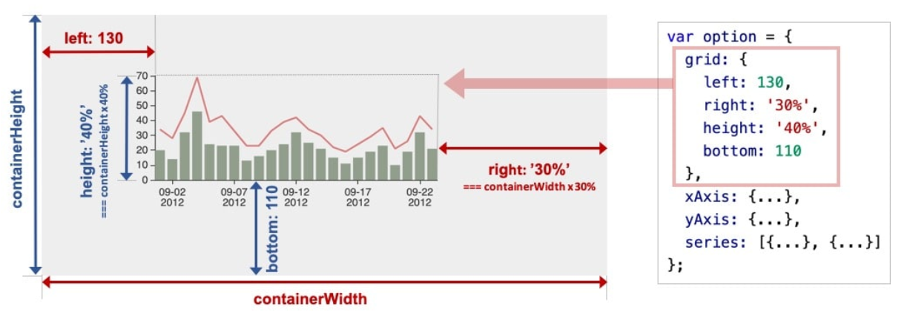

# ECharts

## ECharts 实例

* 准备一个DOM节点(作为echarts的渲染容器)。每个echarts实例独占一个DOM节点。

### 系列(series)

* 系列：一组数值以及他们映射成的图。
* 系列三要素：一组数值、图表类型(series.type)、以及其他的关于这些数据如何映射成图的参数。
* 系列类型(series.type)：line(折线图)、bar(柱状图)、pie(饼图)、scatter(散点图)、graph(关系图)、tree(树图)


### 组件（component）

* 组件：
  * legend(图示)
  * xAxis(直角坐标系x轴)
  * yAxis(y轴)
  * grid(直角坐标系底板)
  * angleAxis(极坐标系角度轴)
  * radiusAxis(极坐标系半径轴)
  * geo(地理坐标系)
  * dataZoom(数据区缩放组件)
  * visualMap(视觉映射组件)
  * tooltip(提示框组件)
  * toolbox(工具栏组件)
  * series(系列)

### 用option描述图表

* option：数据、数据如何映射成图形、交互行为

```js
// 创建 echarts 实例。
var dom = document.getElementById('dom-id');
var chart = echarts.init(dom);

// 用 option 描述 `数据`、`数据如何映射成图形`、`交互行为` 等。
// option 是个大的 JavaScript 对象。
var option = {
    // option 每个属性是一类组件。
    legend: {...},
    grid: {...},
    tooltip: {...},
    toolbox: {...},
    dataZoom: {...},
    visualMap: {...},
    // 如果有多个同类组件，那么就是个数组。例如这里有三个 X 轴。
    xAxis: [
        // 数组每项表示一个组件实例，用 type 描述“子类型”。
        {type: 'category', ...},
        {type: 'category', ...},
        {type: 'value', ...}
    ],
    yAxis: [{...}, {...}],
    // 这里有多个系列，也是构成一个数组。
    series: [
        // 每个系列，也有 type 描述“子类型”，即“图表类型”。
        {type: 'line', data: [['AA', 332], ['CC', 124], ['FF', 412], ... ]},
        {type: 'line', data: [2231, 1234, 552, ... ]},
        {type: 'line', data: [[4, 51], [8, 12], ... ]}
    }]
};

// 调用 setOption 将 option 输入 echarts，然后 echarts 渲染图表。
chart.setOption(option);
```

### 组件的定位

* 类CSS的绝对定位

    

  * left、right、width是一组；top、bottom、height是一组。

* 中心半径定位
  * 依据center(中心)、radius(半径)来决定位置。

### 坐标系

* 一个坐标系，可能由多个组件协作而成
* 直角坐标系中，包括有xAxis、yAxis、grid三种组件
  
  
  
  

## 个性化表格的样式

* ECharts提供了丰富的自定义配置选项，并且能从全局、系列、数据三个层级去设置数据图形的样式。

### 绘制南丁格尔图

```js
option = {
    series : [
        {
            name: '访问来源',
            type: 'pie',
            radius: '55%',
            // ECharts 中的饼图也支持通过设置 roseType 显示成南丁格尔图
            roseType: 'angle',
            data:[
                {value:235, name:'视频广告'},
                {value:274, name:'联盟广告'},
                {value:310, name:'邮件营销'},
                {value:335, name:'直接访问'},
                {value:400, name:'搜索引擎'}
            ]
        }
    ]
};
```

### 阴影的配置

```js
option = {
    series : [
        {
            name: '访问来源',
            type: 'pie',
            radius: '55%',
            data:[
                {value:235, name:'视频广告'},
                {value:274, name:'联盟广告'},
                {value:310, name:'邮件营销'},
                {value:335, name:'直接访问'},
                {value:400, name:'搜索引擎'}
            ],
            roseType: 'angle',
            itemStyle: {
                normal: {
                    shadowBlur: 200,
                    shadowColor: 'rgba(0, 0, 0, 0.5)'
                }
            }
        }
    ]
};
```

* itemStyle的emphasis是鼠标 hover 时候的高亮样式。

```js
itemStyle: {
    emphasis: {
        shadowBlur: 200,
        shadowColor: 'rgba(0, 0, 0, 0.5)'
    }
}
```

```js
option = {
    backgroundColor: '#2c343c',
    series : [
        {
            name: '访问来源',
            type: 'pie',
            radius: '55%',
            data:[
                {value:235, name:'视频广告'},
                {value:274, name:'联盟广告'},
                {value:310, name:'邮件营销'},
                {value:335, name:'直接访问'},
                {value:400, name:'搜索引擎'}
            ],
            roseType: 'angle',
            //分别设置每个系列的文本颜色
            label: {
                normal: {
                    textStyle: {
                        color: 'rgba(255, 255, 255, 0.3)'
                    }
                }
            },
            //将标签的视觉引导线的颜色设为浅色
            labelLine: {
                normal: {
                    lineStyle: {
                        color: 'rgba(255, 255, 255, 0.3)'
                    }
                }
            },
            //设置阴影颜色
            itemStyle: {
                normal: {
                    shadowBlur: 200,
                    shadowColor: 'rgba(0, 0, 0, 0.5)'
                }
            }
        }
    ]
};
```

### 设置扇形的颜色

```js
itemStyle: {
    // 设置扇形的颜色
    color: '#c23531',
    shadowBlur: 200,
    shadowColor: 'rgba(0, 0, 0, 0.5)'
}
```

* 每个扇形颜色的可以通过分别设置 data 下的数据项实现

```js
data: [{
    value:400,
    name:'搜索引擎',
    itemStyle: {
        color: '#c23531'
    }
}, ...]
```

* 通过 visualMap 组件将数值的大小映射到明暗度

```js
visualMap: {
    // 不显示 visualMap 组件，只用于明暗度的映射
    show: false,
    // 映射的最小值为 80
    min: 80,
    // 映射的最大值为 600
    max: 600,
    inRange: {
        // 明暗度的范围是 0 到 1
        colorLightness: [0, 1]
    }
}
```
