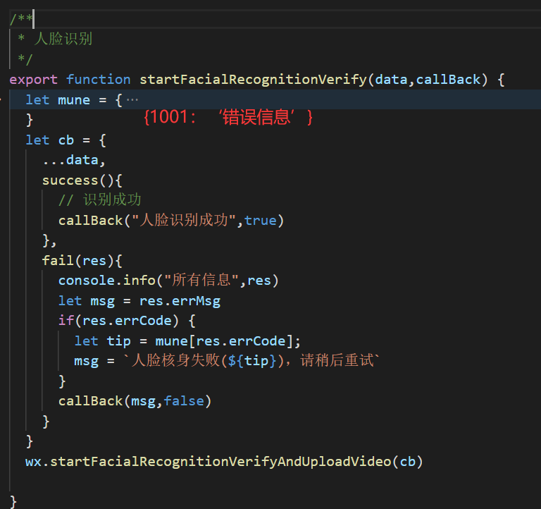
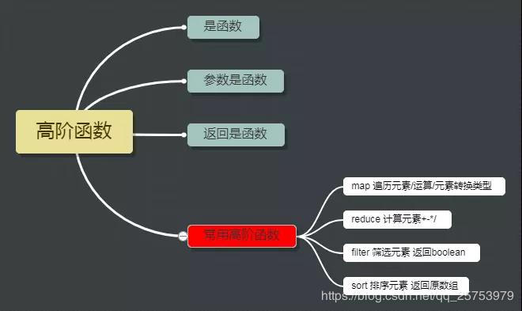

# Question & Answer

## 小程序

* 小程序为啥不能用window
  * 因为在jscode中运行的，这是一个没有窗口对象的环境

* 封装api
  * 多种情况做判断匹配时，可使用**js对象的方式储存，再用object[key]取出**



* bug：textarea与原生下拉框重叠 -- 实现textarea与view的切换展示

* 小程序文本可复制 -- text标签

* 长按识别二维码 -- image标签设置**show-menu-by-longpress**属性为true

* 删除对象属性 **`delete Object.属性`**

### 小程序渲染图片出现403

* 访问别人服务器时，连本地的防盗链（referrer）也携带了过去。携带了防盗链，别人的服务器就会对此做相关处理，看看是不是本站在访问，否则给个403。
* 解决403的方法，就是不要设置防盗链。可是我不会设置referrer，也不知道有没有。
* 就换了个方法，换一个链接可以访问图片的链接：可以使用`images.weserv.nl`链接来访问报403的图片

`https://images.weserv.nl/?url=网络图片地址`

### 请求封装

```js
  // service > api > index.js
  export default {
    KgetAreaList: '/claimCard/getAreaList', //获取区域级
    KsendCaptcha: '/claimCard/sendCaptcha', //发送手机验证码
    KcheckCaptcha: '/claimCard/checkCaptcha', //校验验证码
    KgetGdCity: '/claimCard/getGdCity', //获取广东省下拉
  }
```

```js
  // service > index.js
  const api = require('./api/index')
  const apiHost = 'https://ssmi.cebbank.com/Integration'
  function createRequest(url ,method = 'post'){
    return function (data,callback,config = {}){
      let successM = res => {
        if(res.data.data && JSON.stringify(res.data.data) !== "{}"){
          console.info("响应回参",res.data.data)
        }else{
          console.info("响应回参为空")
        }
        callback(res.data);
      }
      let option = Object.assign({
        url:apiHost + url,
        data:data,
        success:successM,
        method:method
      },config)
      wx.request(option)
    }
  }
  var service = {} // 方法集
  var apis= api.default
  Object.keys(apis).forEach(module => {
    const apiConfig = apis[module]
    if(typeof apiConfig === 'string') {
      service[module] = createRequest(apiConfig)
    }else {
      service[module] = createRequest(apiConfig.url,apiConfig.method)
    }
  })
  module.exports = service
```

### 组件封装

1. 定义
    1.1  在.json文件中做自定义组件声明

```json
 {
  "component": true
 }
```

    1.2 在wxml文件编写组件模板，在wxss文件中加入组件样式
    1.3 在自定义组件的js文件中，需要使用Component()来注册组件，并提供组件的属性定义、内部数据和自定义方法

```js
Component({
   // 组件的对外属性
   properties: {
       innerText: {
           type: String, // 类型 -- 必填
           value: '', // 属性初始值 -- 可选
           observer(newVal, oldVal, changePath) {
               // 属性改变时的执行函数 -- 可选
           }
       },
       myProperty2: String
   },
   // 私有数据，供组件内使用，可用于模板渲染
   data: {},
   // 组件的方法列表
   methods: {
       // 内部方法建议以下划线开头
   }
})
```

2. 使用自定义组件
    2.1 在json文件中进行引用声明

```json
{
   "usingComponents": {
       "conponent-tag-name": "path/component"
   }
}
```

   2.2 在页面的wxml中就可以像使用基础组件一样使用

```html
<view>
   <component-tag-name inner-text="some text"></component-tag-name>
</view>
```

### 功能 && api

#### 实现小程序分享到朋友圈

> 小程序页面默认不可被分享到朋友圈，开发者需主动设置。

* 页面允许被分享到朋友圈，需满足两个条件：
  * 页面需设置“发送给朋友” --- **Page.onShareAppMessage**
  * 页面需设置允许“分享到朋友圈”，同时可自定义标题、分享图等 --- **Page.onShareTimeline**

```js
Page({
    // 第一步：设置可被分享
    onShareAppMessage(res) {
        return {
            title: '传统分享的标题'
        }
    },
    // 第二步：设置分享到朋友圈的标替
    onShareTimeline(res) {
        return {
            title: '转发到朋友圈',
            query: '我是携带的参数'
        }
    }
})
```

#### 人脸识别 wx.startFacialRecognitionVerify(OBJECT)

> 验证方式：在线验证 -- 读数字 屏幕闪烁

```js
/**
 * return 值
 * errMsg: String 错误信息
 * errCode：Number 错误码
 * verifyResult: String 本次认证结果凭证
*/
wx.startFacialRecognitionVerify({
    name: String, // 必填
    idCardNumber: String, // 必填
    success: Function,
    fail: Function,
    complete: Function, // 必填
    // 0-读数字 1- 反光 2-检查是否支持反光
    checkAliveType: Number
})
```

#### 小程序内跳转至其他小程序 wx.navigateToMiniProgram(Object object)

```js
wx.navigateToMiniProgram({
    appId: string, // 必填--要打开的小程序appId
    path: string, // 打开的页面路径，为空则打开首页
})
```

#### 文本复制 wx.setClipboardData(object)

```js
var inviteName = that.data.copyData[2].url;
wx.setClipboardData({
    //准备复制的数据
    data: inviteName,
    success: function (res) {
      this.toastComponent.showToastComponent("复制成功")
    }
});
```

#### base64转临时url

```js
//声明文件系统
const fs = wx.getFileSystemManager();
//随机定义路径名称
var times = new Date().getTime();
var codeimg = wx.env.USER_DATA_PATH + '/' + times + '.png';
//将base64图片写入
fs.writeFile({
  filePath: codeimg,
  data: pics,
  encoding: 'base64',
  success: () => {
    //写入成功了的话，新的图片路径就能用了
    var urls = new Array(codeimg)
    wx.previewImage({
      //当前显示图片
      urls,
    })
  }
});
```

## 公众号

* 公众号开发时，接口没有用/api开头却可以实现代理？
  * 因为设置了电脑的host 实现了代理`C:\Windows\System32\drivers\etc\host`

## vue

* 如何实现监听对象中一个属性的变化？

```js
rule:{
    name:"",
    age:""
}

computed: {
    getName: function() {
        return this.rule.name
    }
},
watch:{
    getName:{
        handler:function(){
            //do something
        }
    }
}

```

## 路由-vue

* 如何实现路由懒加载?

```js
import Vue from 'vue';
import VueRouter from 'vue-router';
Vue.use(VueRouter);

const router = new VueRouter({
    routes: [{
        name: '',
        path: '',
        meta: {
            title: '',
            requireAuth: '',
        },
        // 使用import动态引入异步组件
        component: () => import('@/index')
    }]
})
```

* 如何实现路由嵌套？

```js
import Vue from 'vue';
import VueRouter from 'vue-router';
Vue.use(VueRouter);

const User = () => import('@/index');
const Profile = () => import('@/index/profile');
const router = new VueRouter({
    routes: [{
        name: 'user',
        path: '/user',
        component: User,
        children: [{
            // 当user/profile匹配成功时，组件会被渲染在User组件的<router-view></router-view>中
            name: 'profile',
            path: '/profile',
            component: Profile
        },{
            name: '',
            path: '',
            component: ''
        }]
    }]
})
```

* 如何实现路由拦截？
    1. 定义路由时，通过meta属性添加一个自定义字段[requireAuth]
    2. 利用全局路由钩子beforeEach()对路由进行判断
       1. 先判断该路由是否需要权限[to.meta.requireAuth]
       2. 再获取当前token是否存在
       3. 存在则next()，否则将跳转的路由path作为参数，登录成功后跳转至该路由

```js
//定义路由元信息，确定哪个路由需要登陆权限
//router>index.js
import Vue from 'vue';
import VueRouter from 'vue-router';
Vue.use(VueRouter);

const router = new VueRouter({
    routes: [{
       name:'cart',
       path:'/cart',
       component:Cart,
       meta:{ requiresAuth :true}
    }]
})

//进入路由后，确认用户是否登录
//[全局路由守卫中做判断]
//如何实现登陆后跳回原页面？
//query & this.$route
//a: 登录则放行 -- [暂时]
//b: 否则跳转至登录界面并传递目标路由地址

//app>routers>index.js -- 确认用户是否登录
router.beforeEach((to,from,next)=>{
    //判断当前路由是否需要路由权限
    if(to.meta.requiresAuth){
        //获取token
        let Authorization = localStorage.getItem('Authorization');
        if(Authorization){
            //登录则放行
            next();
        }else{
            //否则跳转到登录页面
            //同时传递路由地址 -- 为了登录后能够再次返回
            // router.push('/login');
            next({
                path:'/login',
                query:{
                    redirectUrl : to.fullPath
                }
            });
        }
    }else{
        next();
    }
})
```

* 在单个vue文件实现流程切换,并做监听回退

```js
watch: {
    '$route.fullPath': function() {
        let list = this.getQueryVariable('state')
        this.statusArr.map((item,index) => {
            if(index == list && this.status !== item) {
                console.log(index,list,this.status,item);
                this.handleHistory(list)
            }
        })
    }
},
methods: {
    //用于判断历史栈，是否推新的历史记录 @param n 当前的状态序号
    handleHistory(n){
        this.index=n
        this.$router.push({name: 'shenLing', query: {state: this.index}})
    },
    //跳转到下一步
    async toNext(){
        if(this.status === 'xuZhi') {
            setTimeout(() => this.handleHistory(1), 1000) ;
        } else if() {}
    }
}

```

## ajax

* 对ajax的理解？编写用ajax发生GET、POST请求
  * ajax即异步的javaScript和XML，它通过在后台与服务器进行少量数据交换，使得网页可以在不重新加载整个网页的情况下，对网页的某部分进行更新。即实现了异步更新。

```js
// 先创建网络请求
let xhr = new XMLHttpRequest();
// 设置请求对象（方法、路径、异步）
xhr.open(method, url, async);
// 发送网络请求
xhr.setRequestHeader(); // post 请求设置请求头编码格式
xhr.send(string); // 一般用get时string为空
// 监听网络请求的状态
xhr.onReadyStateChange = function() {
    if(xhr.readyState == 4) {
        if(xhr.status == 200) {
            // json -> js对象
            let data = JSON.parse(xhr.responseText);
        } else {}
    }
    let timer = setTimeout(() => {
        xhr.abort();
        clearTimeout(timer)
    },timeout)
}
```

* 如何将后台返回的文件流转为excel？并且不乱码？

```js
downloadFile() {
    this.$axios.post('/applycard-service/admin/exportExcel',
    this.formData, {
        headers: {
            Authorization: `Bearer ${this.token}`
        },
        // 请求头增加responseType，将后台返回的数据转为blob类型 [blob -- 类文件对象] -- 解决乱码
        responseType: 'blob',
    })
    .then((res) => {
        const blob = new Blob([res.data]);
        const downloadElement = document.createElement('a');
        // 创建下载的链接
        const href = window.URL.createObjectURL(blob);
        downloadElement.href = href;
        // 下载后的文件名
        downloadElement.download = `批量开卡_${this.getNowTime()}.xls`;
        document.body.appendChild(downloadElement);
        downloadElement.click(); // 下载
        // 下载完成 移除 a
        document.body.removeChild(downloadElement);
        // 释放blob对象
        window.URL.revokeObjectURL(href);
    });
},
```

## js

* 如何理解事件委托？`var currentTarget = e.target || e.srcElement;`
  * 事件委托就是利用事件冒泡的原理，将事件绑定在父级元素身上。
  * 利用事件委托，可以给尚未存在的标签绑定事件。

```js
goto(e) {
    let currentTarget = e.target || e.srcElement;
    let index = currentTarget.getAttribute("data-index");
    if(index === 'userManage' || index === 'applyManage') {
        this.$router.push({
            path: `/userCenter/${index}`
        })
        if(index === 'userManage') {
            this.userManageFlag = true;
            this.applyManageFlag = false;
            this.userMain = '用户管理';
        } else if(index === 'applyManage') {
            this.applyManageFlag = true;
            this.userManageFlag = false;
            this.userMain = '应用管理';
        }
    }
},
```

```html

```

* 高阶函数
  * 接收函数作为参数或者返回函数的函数


```js
/**
 * 检验规则
 *   大于18岁
 *   密码长度大于8
 *   统一用户协议
 * */
const newUser = {
    age: 24,
    password: 'some long password',
    agreeToTerms: true
}
function oldEnough(user) {
    return user.age >= 18;
}
function passwordLongEnough(user) {
    return user.password.length >= 8;
}
function agreeToTerms(user) {
    return user.agreeToTerms === true;
}

// 高阶函数 --> 一次性完成所有验证
function validate(obj, ...tests) {
    for(let i = 0; i < tests.length; i++) {
        if(tests[i](obj) === false) {
            return false;
        }
    }
    return true;
}

// 使用
const newUser1 = {
    age: 40,
    password: 'qwertyuio',
    agreeToTerms: true
}
validate(newUser1, oldEnough, passwordLongEnough, agreeToTerms);
// true

const newUser2 = {
    age: 40,
    password: 'qwer',
    agreeToTerms: true
}
validate(newUser1, oldEnough, passwordLongEnough, agreeToTerms);
// false

// 遵循最少知识原则
function createValidator(...tests) {
    return function(obj) {
        for(let i = 0; i < tests.length; i++) {
            if(tests[i](obj) === false) {
              return false;
          }
        }
        return true;
    };
}

// 使用
const userValidator = createValidator(
    oldEnough,
    passwordLongEnough,
    agreeToTerms
);
userValidator(newUser1); // true
userValidator(newUser2); // false
```

## ES6

* let关键字
  * let声明的变量不会提升至全局作用域
  * let在同级作用域不允许重复声明
  * let会形成块级作用域
  * 暂时性死区：let/const 会使区块形成封闭的作用域。若在声明之前使用变量，就会报错。

```js
    let len = 10;
    function fn() {
        console.info(this.len)
    }
    fn();// this->window --> undefined
    let Person = {
        len: 5,
        say: function() {
            fn(); // undefined
            // arguments 是参数伪数组
            arguments[0](); // undefined
        }
    }
    Person.say(fn);
```

## ecarts

* html页面没报错，但是图形显示不出来？
  * 没有设置宽高

## canvas

```js
// 微信拍照
getPhoto(e) {
    let input = e.target
    let file = input.files[0]
    // FileReader 对象允许Web应用程序异步读取存储在用户计算机上的文件（或原始数据缓冲区）的内容，使用 File 或 Blob 对象指定要读取的文件或数据。
    //  FileReader仅用于以安全的方式从用户（远程）系统读取文件内容 它不能用于从文件系统中按路径名简单地读取文件。 要在JavaScript中按路径名读取文件，应使用标准Ajax解决方案进行服务器端文件读取，如果读取跨域，则使用CORS权限。
    let reader = new FileReader()

    // 该事件在读取操作完成时触发。
    reader.onload = (e)=> {
        // 1 为了将图像显示到画布上，需要创建一个Image()对象的实例，
          let img = new Image;
          let iheight;
          let iwidth;//图片resize宽度
          let quality = 1;//图像质量
          // 获取2d环境
          let canvas = document.createElement("canvas");
          let drawer = canvas.getContext("2d");
        if (input.getAttribute('id') == 'fromCam3' || input.getAttribute('id') == 'refromCam3' ||
            input.getAttribute('id') == 'fromCam5'|| input.getAttribute('id') == 'refromCam5') {
            iheight = 640 //1280////441
        } else {
            iheight = 720//500//300//200//960
        }
        // 2 将Image.src属性设为将要加载的图像的名字。
        img.src = e.target.result
        // 3 在显示图像之前，需要等待图像加载完毕。
        img.onload = ()=> {
            img.onload =null
            iwidth = iheight * (img.width / img.height) // 保持图片的宽高比例 进行图片的缩放
            canvas.width = iwidth
            canvas.height = iheight
            // 4 图像加载
            drawer.drawImage(img, 0, 0, iwidth, iheight)

            let finalSrc
            let degree = 90 * Math.PI / 180 // 1/4圆
            if (input.getAttribute('id') == 'fromCam1' || input.getAttribute('id') == 'fromCam2') {
                // 5 将竖放的照片旋转为横放
                if(iwidth<iheight){
                    canvas.width = iheight
                    canvas.height = iwidth
                    drawer.rotate(degree)
                    drawer.drawImage(img, 0, -iheight, iwidth, iheight)
                }
            }

            if (input.getAttribute('id') == 'fromCam3' || input.getAttribute('id') == 'refromCam3' ||
            input.getAttribute('id') == 'fromCam5'|| input.getAttribute('id') == 'refromCam5') {
                if(iwidth>iheight){
                    //将横放的照片旋转为竖放
                    iwidth = 640 //1280 //441
                    iheight = iwidth * (img.height / img.width)
                    canvas.width = iheight
                    canvas.height = iwidth
                    drawer.rotate(degree)
                    drawer.drawImage(img, 0, -iheight, iwidth, iheight)
                }
            }
            // 返回一个包含图片展示的 data URI
            // 参一：图片格式，默认为 image/png
            // 参二：在指定图片格式为 image/jpeg 或 image/webp的情况下，可以从 0 到 1 的区间内选择图片的质量。
            finalSrc = canvas.toDataURL("image/jpeg", quality)

            if (input.getAttribute('id') == 'fromCam1') {
                //身份正面
                this.imageData1 = finalSrc
                this.isActive = true
            } else if (input.getAttribute('id') == 'fromCam2') {
                //身份反面
                this.imageData2 = finalSrc
                this.isActive = true
            } else if (input.getAttribute('id') == 'fromCam3') {
                //证件照
                this.imageData3 = finalSrc
                this.handleHistory(5)
            }
            else if (input.getAttribute('id') == 'refromCam3') {
                //证件照重拍
                this.imageData3 = finalSrc
            }
            else if (input.getAttribute('id') == 'fromCam5') {
                //手持证件照
                this.imageData4 = finalSrc
                this.handleHistory(7)
            }
            else if (input.getAttribute('id') == 'refromCam5') {
                //手持证件照重拍
                this.imageData4 = finalSrc
            } else if(input.getAttribute('id') == 'fromCam6') {
                this.imageData3 = finalSrc
            }
            this.loading = false
        }
    };
    reader.readAsDataURL(file)
},
```

## 面试题

* 项目如果重构你会选择重构哪些地方？重构的方法以及必要性？
* vuex的用法，vuex和bus总线的区别
  * vuex是一个专门为vue.js程序开发的状态管理模式，
  * vuex实现数据共享，跨组件传参，适用大型项目;
  * bus当组件层级嵌套不深的时候可以用，适用于小型项目

* vue的响应式原理，以及get set分别做了什么
  * vue在实例化时会遍历data下的属性，并通过object.defineProperty()把这些属性转为setter getter，并写入vue的实例。
  * setter的时候会收集依赖，getter的时候会触发依赖。

* js的执行机制
  > 异步
  * 微任务：Promise process.nextTick
  * 宏任务：整体代码script setTimeout setInterval
  * 微队列为空时执行宏队列
    > async 语法操作符[不算同步，不算异步]
    > async -> await promise

* 异步编程
  * 实现异步编程的方法有哪些？
    * async && await
    * promise
    * 回调

  * 怎么理解async && await, async && await 怎么来的？
    * async && await 都是函数定义的关键字。await用于等待Promise对象的返回结果，且不能单独使用而必须放在async函数中；利用async定义的函数会返回一个Promise对象，async函数的返回值就是Promise状态为resolved的返回值。
    * async && await 使得异步代码看起来像同步代码。
    * async await 是基于Promise实现的，他不能用于普通的回调函数。

  * async && await 和 promise的用法的区别，举例
    * await 关键字只能用在async定义的函数内，async函数会隐式地返回一个promise，该promise的resolve值就是函数return的值。

  * async && await 和 promise的性能区别在哪里
    * 使用async函数会让代码简洁很多，不需要像Promise一样需要写then，不需要写匿名函数处理Promise的resolve值，也不需要定义多余的data变量，还避免了嵌套代码。
    * 错误处理
      * async await 让try/catch 可以同时处理同步和异步错误。在Promise中try/catch不能处理JSON.parse,需要使用.catch。
      * 使用async await catch能处理JSON.parse错误。

    ```js
    // 调用promise1，使用promise1返回的结果去调用promise2，然后使用两者的结果去调用promise3
    const makeRequest = () => {
      return promise1().then(value1 => {
        return promise2(value1).then(value2 => {
          return promise3(value1, value2)
        })
      })
    }
    // 使用promise.all避免深层嵌套
    const makeRequest = () => {
      return promise1().then(value1 => {
        return Promise.all([value1, promise2(value1)])
      }).then(([value1, value2]) => {
        return promise3(value1, value2)
      })
    }
    // 使用async await
    const makeRequest = async () => {
      const value1 = await promise1()
      const value2 = await promise2(value1)
      return promise3(value1, value2)
    }
    ```

* eventLoop
  * 因为js是一种单线程语言，如果遇到大量任务或者遇到一个耗时的任务，网页就会出现假死。eventLoop就是为了解决这种“堵塞”现象而提出的。
  * eventLoop是一个程序结构，用于等待和发送消息和事件。
  * 就是在程序中设置两个线程：一个负责程序本身的运行，称为“主线程”；另一个负责主线程与其他进程的通信（主要是各种io操作），成为“eventLoop线程”。

* 设计模式
* 树的算法
