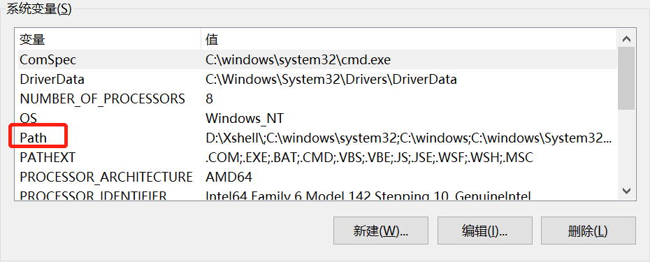

## mongodb + robot

### mongodb 安装完配置path




#### 在MongoDB安装目录下新建文件夹

* data文件夹
* log文件夹

#### 在MongoDB安装目录下新建mongo.config配置文件并配置以下内容

> dbpath=D:\mongodb\data
> logpath=D:\mongodb\log\mongo.log

#### 跑起配置文件

> D:\mongodb\bin\mongod.exe --config D:\mongodb\mongo.config

> mongo

### NodeJS中使用mongodb

#### 搭建服务器

* server.js
```js
// 引入第三方模块
const express = require('express');

// 利用express创建一个服务器
const app = express();
const { PORT } = require('./config.json');

// 引入路由总中间件
const allRouter = require('./routers');

// 搭建静态资源服务器
app.use(express.static('/'));

// 使用路由总中间件
app.use(allRouter);

// 监听服务器开启
app.listen(PORT, () => {
    console.log(`Server is running on port ${PORT}`);
})
```

* routers/index.js
```js
const express = require('express');
let Router = express.Router();

let classifyRouter = require('./classify');

// 跨域解决方案CORS
Router.use((req,res,next) => {
    let currentOrigin = req.get('Origin');
    let allowOrigin = ['http://localhost:8080', 'http://localhost:8081', 'http://localhost:8082', 'http://localhost:8083'];
    if(allowOrigin.includes(currentOrigin)) {
        res.set({
            'Access-Control-Allow-Origin': currentOrigin,
            'Access-Control-Allow-Methods': 'GET, POST, PUT, PATCH, DELETE, OPTION',
            'Access-Control-Allow-HEADERS': 'Content-Type, Content-Length, Authorization, Accept, X-Requested-With'
        })
    }
    // 跨域请求CORS中的预请求
    if(req.method == 'OPTIONS') {
        res.sendStatus(200); // 让option请求快速返回
    } else {
        next();
    }
})

// 格式化请求体中的参数
Router.use(express.json(), express.urlencoded({extended:false}));

// 关联中间件
Router.use('/classify', classifyRouter);

module.exports = Router;
```

#### 数据库连接

##### 连接mongodb
```js
const mongodb = require('mongodb');
const MongoClient = mongodb.MongoClient;

//连接mongoDB
MongoClient.connect('mongodb://localhost:27017',(err,client) => {
    if(error) throw error;

    //连接数据库，无则自动创建
    let db = client.db('pleaseAnswer');
})
```

##### connect() + close()

```js
const {MongoClient, ObjectId} = require('mongodb');

const {dbUrl, dbName} = require('../config.json');

async function connect() {
    const client = await MongoClient.connect(dbUrl, {
        useUnifiedTopology: true
    })
    const db = client.db(dbName);
    return {
        client,
        db
    }
}
```

* 在自定义方法中，调用connect() 方法连接数据池，使用client.close() 方法关闭数据池
