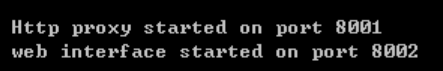
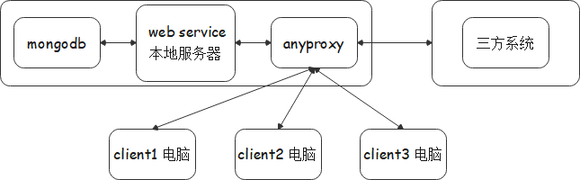

### 工具说明

1. node
2. anyproxy
3. mongodb

#### node

> 程序的运行环境

#### anyproxy

> anyproxy是一个客户端代理服务器【正向代理】，浏览器通过设置全局代理后，所有的http服务请求均要通过它来进行代理请求。

##### 安装

1. 执行命令全局安装 > npm i anyproxy -g
2. 执行命令检查是否正确安装 > anyproxy

##### 代理设置

1. 进入【控制面板】
2. 找到【Internet选项】
3. 点击【连接】选项
4. 点击【局域网设置】会弹出局域网(LAN)设置窗口
5. 找到代理服务器
6. 选中【为LAN使用代理服务器】，在地址输入：127.0.0.1 端口：8001
7. 确定，保存代理

##### 启动

1. 启动里需带规则文件，在本地搭建的服务器存放符合anyproxy编写规范的"缓存修改规则js文件` proxy_rule.js`"

2. 执行命令 > anyproxy --rule proxy_rule.js

   

3. 浏览器打开http://127.0.0.1:8002 显示管理页面说明启用成功

#### mongodb

> mongodb是对象数据库，用来存储补充录入的数据

##### 安装

##### 配置path


##### 启用

1. 在mongodb安装目录下新建mongodb.config配置文件，内容如下：
```js
    dbpath=D:\mongodb\data
    logpath=D:\mongodb\log\mongo.log
```

2. 在当前位置打开cmd命令行窗口
3. 执行命令：> mongod.exe --config mongo.config
4. 浏览器打开 http://127.0.0.1:27017 -- 有如下显示说明启动成功


### 数据处理

#### 数据处理服务器

> 使用nodejs搭建本地服务器--用于读取本地服务器，并配合写入页面的脚本文件做字段数据填充

#### 数据处理后台

> 数据处理后台用来把已经处理好的excel数据导入mongodb中
> 运行环境为node

1. 进入server目录位置


2. 执行命令启动本地服务：> npm start

### 网络架构




