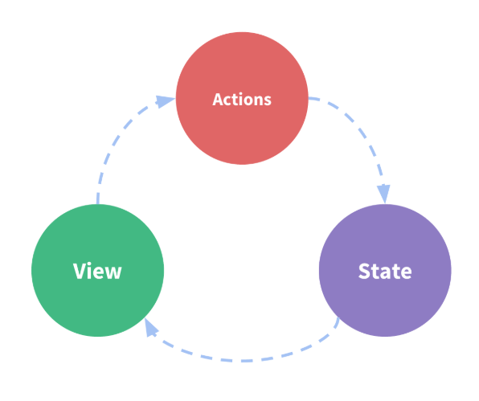
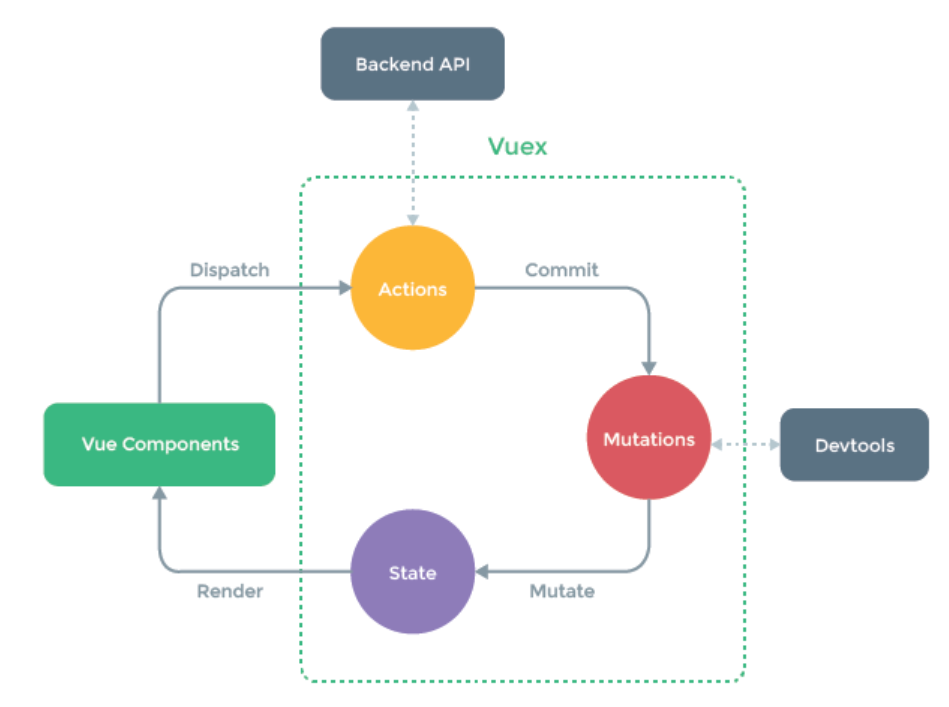

# Vuex

> Vuex 是一个专为 Vue.js 应用程序开发的状态管理模式。它采用集中式存储管理应用的所有组件的状态，并以相应的规则保证状态以一种可预测的方式发生变化。

## 状态管理模式

*1*. 单向数据流



*2*. 多组件共享时 -> 多个视图依赖于同一状态 && 来自不同视图的行为需要变更同一状态

*3*. 通过定义和隔离状态管理中的各种概念并通过强制规则维持视图和状态间的独立性 -> 管理共享状态



## 认识vuex

* 每一个 Vuex 应用的核心就是 store（仓库）。store 基本上就是一个容器，它包含着应用中大部分的状态 (state)。
* Vuex 和单纯的全局对象有以下两点不同：

    *1*. Vuex 的状态存储是响应式的。当 Vue 组件从 store 中读取状态的时候，若 store 中的状态发生变化，那么相应的组件也会相应地得到高效更新。
    *2*. 不能直接改变 store 中的状态。改变 store 中的状态的唯一途径就是显式地提交 (commit) mutation。这样使得我们可以方便地跟踪每一个状态的变化，从而让我们能够实现一些工具帮助我们更好地了解我们的应用。

* 创建一个store -> 提供一个初始state对象和一些mutation
* src > store > cart.js

```js
import Vue from 'vue'
// 1. 引入Vuex
import Vuex from 'vuex'

// 2. 使用(安装)Vuex
Vue.use(Vuex);

// 3. 实例化一个Store（一个应用只运行有一个Store）
const store = new Vuex.Store({
    state: {
        goodsList: [{
            id: '',
            name: '',
            price: '',
            qty: ''
        }]
    },
    getters: {
        totalPrice(state) {
            return state.goodsList.reduce((prev, item) => prev + item.price * item.qty, 0)
        }
    }
    // store.commit(mutation)
    mutations: {
        removeFromCart(state, id) {
            state.goodsList = state.goodsList.filter(item => item.id != id)
        },
        clearCart(state) {
            state.goodsList = []
        },
        addCart(state, goods) {
            state.goodsList.unshift(goods)
        },
        changeQty(state, payload) {
            state.goodsList.forEach(item => {
                if(item.id == payload.id) {
                    item.qty = payload.qty
                }
            })
        }
    },
    // 间接修改state的方法 store.dispatch(action)
    actions: {
        async changeQtyAsync(context, {id, qty}) {
            let {data: {data}} = await
            if(qty > data) {
                qty = data;
            }
            context.commit('changeQty', {id, qty})
        }
    }
})
// 4. 把store导出并注入Vue实例
// ！！！tip：注入vue实例
export default store;

// 5. 在组件中使用vuex
// this.$store.state.count
```

* cart.vue

```js
import {mapState, mapGetters, mapMutations, mapActions} from 'vuex'
export default {
    data() {return {}},
    computed: {
        // goodsList() {
        //     return this.$store.state.goodsList
        // }
        // 可以通过 store.state 来获取状态对象
        ...mapState({
            goodsList(state) {
                return state.goodsList
            }
        }),
        // totalPrice() {
        //     return this.$store.getters.totalPrice
        // }
        ...mapGetters(['totalPrice'])
    },
    methods: {
        // removeItem(id) {
        //     this.$store.commit('removeFromCart', id)
        // }
        // 通过 store.commit() 方法来触发状态变更
        ...mapMutations({
            removeItem: 'removeFromCart',
            changeQty:(commit, payload)=> {
                commit('changeQty',payload)
            }
        }),
        // clearCart() {
        //     this.$store.commit('clearCart')
        // },
        ...mapMutations(['clearCart']),
        // changeQtyAsync(id, qty) {
        //     this.$store.dispatch('changeQtyAsync', {id, qty})
        // }
        ...mapActions({
            changeQtyAsync(dispatch, id, qty) {
                dispatch('changeAtyAsync', {id, qty})
            }
        })
    }
}
```

* eg: 从组件的方法提交一个变更
  
  > 通过提交 mutation 的方式，而非直接改变 store.state.count -> 为了更加明确地追踪到状态的变化

  ```js
  methods: {
      increment() {
          this.$store.commit('increment')
          console.log(this.$store.state.count)
      }
  }
  ```

## state

> 通过在根实例中注册 store 选项，该store 实例会注入到根组件下的所有子组件中，且子组件能够通过 this.$store 访问到。

```js
const Counter = {
    template: `<div>{{ count }}</div>`,
    computed: {
        count() {
            return this.$store.state.count
        }
    }
}
```

### mapState 辅助函数

* 当一个组件需要获取多个状态时，将这些状态都声明为计算属性会有些复杂和冗余 -> 使用 mapState 辅助函数自动生成计算属性

```js
// 在单独构建的版本中辅助函数为 Vuex.mapState
import { mapState } from 'vuex'

export default {
    computed: mapState({
        // 箭头函数可使代码更简练
        count: state => state.count,

        // 传字符串参数 'count' 等同于 `state => state.count`
        countAlias: 'count',

        // 为了能够使用 `this` 获取局部状态，必须使用常规函数
        countPlusLocalState (state) {
            return state.count + this.localCount
        }
    })
}
```

* 当映射的计算属性的名称与 state 的子节点名称相同时 -> 可以给 mapState 传一个字符串数组

```js
computed: mapState([
    // 映射 this.count 为 store.state.count
    'count'
])
```

* mapState 函数返回一个对象。
  
### 对象展开运算符

* 通过对象展开运算符，可以将 mapState 函数返回的对象与局部计算属性混合使用

```js
computed: {
    localComputed() { /* ... */ },
    // 使用对象展开运算符将此对象混入到外部对象中
    ...mapState({
        // ...
    })
}
```

### 组件仍然保有局部状态

## Getter

> vuex允许我们在 store中定义 getter（可以认为是 store的计算属性）。就像计算属性一样，getter的返回值会根据它的依赖被缓存起来，且只有当它的依赖发生了改变才会被重新计算。
> Getter 接受 state作为其第一个参数

```js
const store = new Vuex.Store({
    state: {
        todos: [
            { id: 1, text: '...', done: true },
            { id: 2, text: '...', done: false }
        ]
    },
    getters: {
        doneTodos: state => {
            return state.todos.filter(todo => todo.done)
        }
    }
})
```

### 通过属性访问

* Getter 会暴露 store.getters对象，你可以以属性的形式访问
  
```js
store.getters.doneTodos // -> [{ id: 1, text: '...', done: true }]
```

* Getter 也接受其他 getter作为第二个参数
  
```js
getters: {
    doneTodosCount: (state, getters) => {
        return getters.doneTodos.length
    }
}
```

```js
store.getters.doneTodosCount // -1
```

* 可以在任何组件使用它

```js
computed: {
    doneTodosCount() {
        return this.$store.getters.doneTodosCount
    }
}
```

* getter 在通过属性访问时是作为vue的响应式系统的一部分缓存其中的

### mapGetters 辅助函数

* mapGetter 辅助函数仅仅是将 store中的 getter映射到局部计算属性

```js
import { mapGetters } from 'vuex'

export default {
    computed: {
        // 使用对象展开运算符将 getter 混入 computed 对象中
        ...mapGetters([
            'doneTodosCount',
            'anotherGetter',
        ])
    }
}
```

* 使用对象形式，给一个getter属性另取一个名字

```js
...mapGetters({
    // 把 `this.doneCount` 映射为 `this.$store.getters.doneTodosCount`
    doneCount: 'doneTodosCount'
})
```

## Mutation

> 更改 Vuex 的 store 中的状态的唯一方法是提交 mutation。
> Vuex 中的 mutation 非常类似于事件：每个 mutation 都有一个字符串的 事件类型 (type) 和 一个 回调函数 (handler)。这个回调函数就是我们实际进行状态更改的地方，并且它会接受 state 作为第一个参数。

```js
store.commit('increment')
// 任何由 "increment" 导致的状态变更都应该在此刻完成。
```

```js
const store = new Vuex.Store({
    state: {
        count: 1
    },
    mutations: {
        increment (state) {
            // 变更状态
            state.count++
        }
    }
})
```

* 不能直接调用一个 mutation handler。
* 这个选项更像是事件注册：当触发一个类型为 increment 的 mutation 时，调用此函数。要唤醒一个 mutation handler，你需要以相应的 type 调用 store.commit 方法

```js
store.commit('increment')
```

### 提交载荷（Payload）

* 可以向 store.commit 传入额外的参数，即 mutation 的 载荷（payload）
  
```js
mutations: {
    increment (state, n) {
        state.count += n
    }
}
```

```js
store.commit('increment', 10)
```

* 大多数情况下，载荷应该是一个对象，这样可以包含多个字段并且记录的 mutation 会更易读

```js
mutations: {
    increment (state, payload) {
        state.count += payload.amount
    }
}
```

```js
store.commit('increment', {
    amount: 10
})
```

### 对象风格的提交方式

* 提交 mutation 的另一种方式是直接使用包含 type 属性的对象
  
```js
store.commit({
    type: 'increment',
    amount: 10
})
```

* 当使用对象风格的提交方式，整个对象都作为载荷传给 mutation 函数，因此 handler 保持不变

```js
mutations: {
    increment (state, payload) {
        state.count += payload.amount
    }
}
```

### Mutation 必须是同步函数

> 每一条 mutation 被记录，devtools 都需要捕捉到前一状态和后一状态的快照。
> 任何在回调函数中进行的状态的改变都是不可追踪的。

```js
mutations: {
    someMutation (state) {
        api.callAsyncMethod(() => {
            state.count++
        })
    }
}
```

### 在组件中提交Mutation

* 可以在组件中使用 this.$store.commit('xxx') 提交 mutation
* 或者使用 mapMutations 辅助函数将组件中的 methods 映射为 store.commit 调用（需要在根节点注入 store）

```js
import { mapMutations } from 'vuex'

export default {
    methods: {
        ...mapMutations([
            'increment', // 将 `this.increment()` 映射为 `this.$store.commit('increment')`

            // `mapMutations` 也支持载荷：
            'incrementBy' // 将 `this.incrementBy(amount)` 映射为 `this.$store.commit('incrementBy', amount)`
        ]),
        ...mapMutations({
            add: 'increment' // 将 `this.add()` 映射为 `this.$store.commit('increment')`
        }),
        ...mapMutations({
            changeQty2:(commit, payload)=>{
                commit('changeQty',payload)
            }
        })
    }
}
```

## Action

* Action 类似于 mutation，不同在于：

> Action 提交的是 mutation，而不是直接变更状态。
> Action 可以包含任意异步操作。

```js
const store = new Vuex.Store({
    state: {
        count: 0
    },
    mutations: {
        increment (state) {
            state.count++
        }
    },
    actions: {
        increment (context) {
          context.commit('increment')
        }
    }
})
```

* Action 函数接受一个与 store 实例具有相同方法和属性的 context 对象
* 可以调用 context.commit 提交一个 mutation，或者通过 context.state 和 context.getters 来获取 state 和 getters。

```js
actions: {
    increment ({ commit }) {
        commit('increment')
    }
}
```

### 分发Actions

* Actions通过 store.dispatch方法触发

```js
store.dispatch('increment')
```

```js
actions: {
    incrementAsync({ commit }) {
        setTimeout(() => {
            commit('increment')
        }, 1000)
    }
}
```

* Actions支持同样的载荷方式和对象方式进行发布

```js
store.dispatch('incrementAsync', {
    amount: 10
})
```

```js
store.dispatch({
    type: 'incrementAsync',
    amount: 10
})
```

### 在组件中分发Action

* 在组件中使用 this.$store.dispatch('xxx') 分发 action
* 或者使用 mapActions 辅助函数将组件的 methods 映射为 store.dispatch 调用（需要先在根节点注入 store）

```js
export default {
    methods: {
        ...mapActions([
            'increment', // 将 `this.increment()` 映射为 `this.$store.dispatch('increment')`

            // `mapActions` 也支持载荷：
            'incrementBy' // 将 `this.incrementBy(amount)` 映射为 `this.$store.dispatch('incrementBy', amount)`
        ]),
        ...mapActions({
            add: 'increment' // 将 `this.add()` 映射为 `this.$store.dispatch('increment')`
        }),
        ...mapActions({
            changeQtyAsync(dispatch, id, qty){
                dispatch('changeQtyAsync', {id, qty})
            }
        })
    }
}

```

### 组合Action

* store.dispatch可以处理被触发的 action的处理函数返回的 Promise，并且store.dispatch 仍旧返回 Promise

```js
actions: {
    actionA ({ commit }) {
        return new Promise((resolve, reject) => {
            setTimeout(() => {
                commit('someMutation')
                resolve()
            }, 1000)
        })
    }
}
```

```js
store.dispatch('actionA').then(() => {
    //...
})
```

```js
actions: {
    actionB({ dispatch, commit }) {
        return dispatch('actionA').then(() => {
            commit('someOtherMutation')
        })
    }
}
```

```js
actions: {
    async actionA({ commit }) {
        commit('gotData', await getData())
    },
    async actionB({ dispatch, commit }) {
        await dispatch('actionA') // 等待actionA完成
        commit('gotOtherData', await getOtherData())
    }
}
```

* 一个 store.dispatch 在不同模块中可以触发多个 action 函数。在这种情况下，只有当所有触发函数完成后，返回的 Promise 才会执行。
