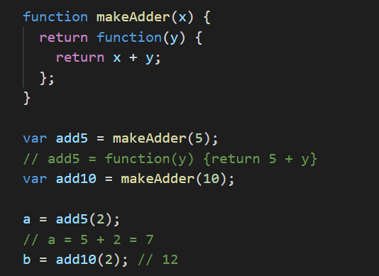
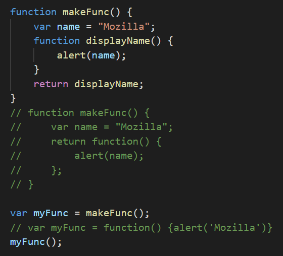
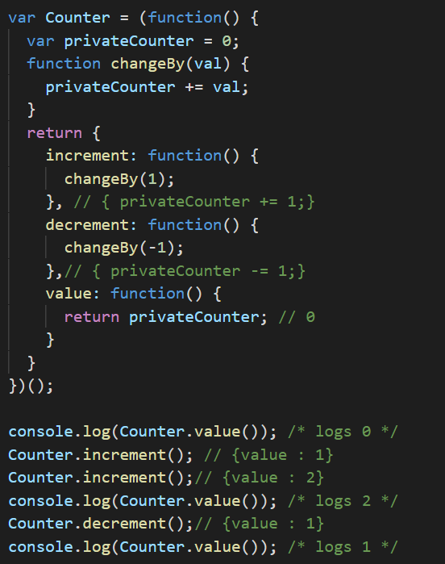
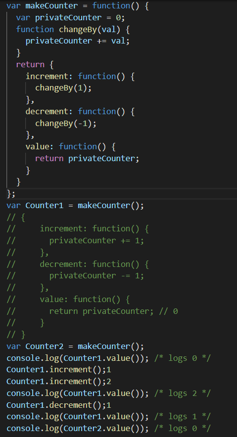

## 闭包

### 1. 闭包是由函数以及声明该函数的词法环境组合而成的

> 词法（lexical）一词指的是，词法作用域根据源代码中声明变量的位置来确定该变量在何处可用

### 2. 用闭包模拟私有方法

*1* 只创建了一个词法环境，为三个函数所共享：Counter.increment，Counter.decrement 和 Counter.value。
*2* 该共享环境创建于一个立即执行的匿名函数体内。这个环境中包含两个私有项：名为 privateCounter 的变量和名为 changeBy 的函数。这两项都无法在这个匿名函数外部直接访问。必须通过匿名函数返回的三个公共函数访问。
*3* 这三个公共函数是共享同一个环境的闭包。

#### tip

* 我们定义了一个匿名函数，用于创建一个计数器。
* 我们立即执行了这个匿名函数，并将他的值赋给了变量Counter。
* 我们可以把这个函数储存在另外一个变量makeCounter中，并用他来创建多个计数器。

*1* 两个计数器 Counter1 和 Counter2 是如何维护它们各自的独立性的。每个闭包都是引用自己词法作用域内的变量 privateCounter 。
*2* 每次调用其中一个计数器时，通过改变这个变量的值，会改变这个闭包的词法环境。
*3* 然而在一个闭包内对变量的修改，不会影响到另外一个闭包中的变量。
